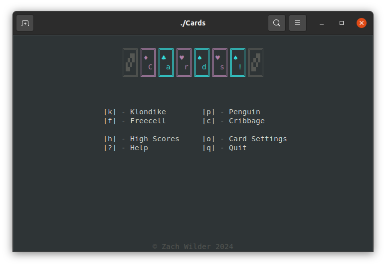
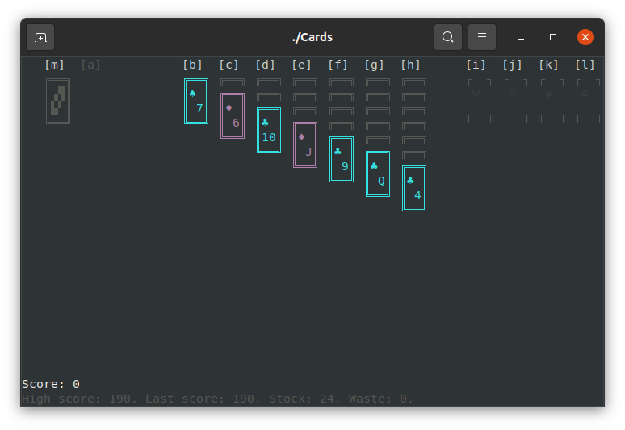
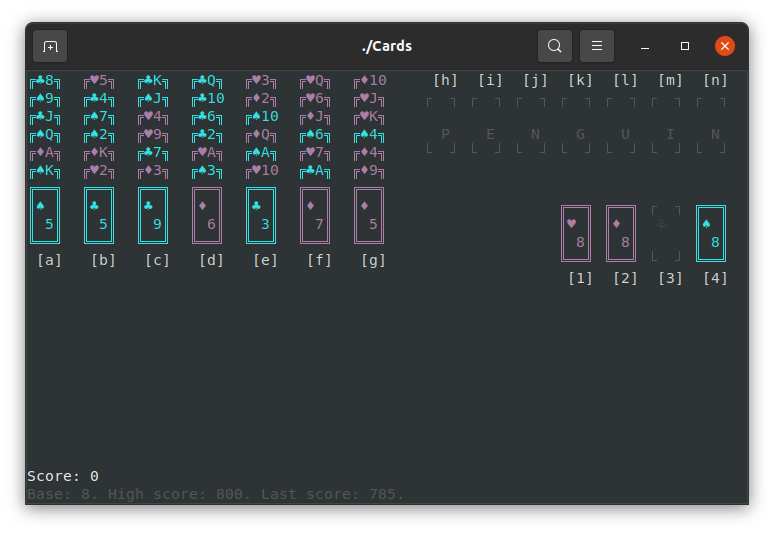
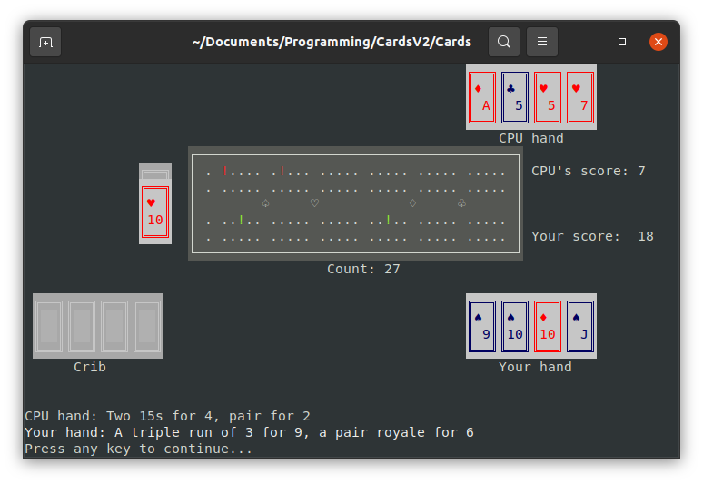
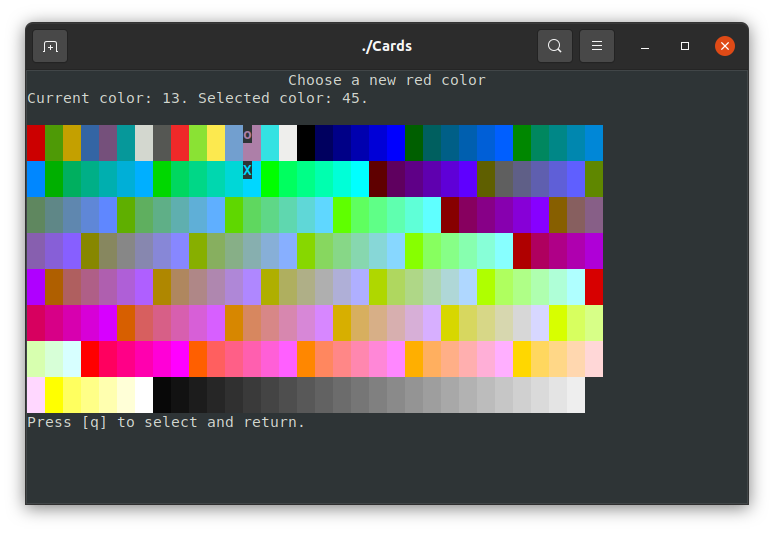
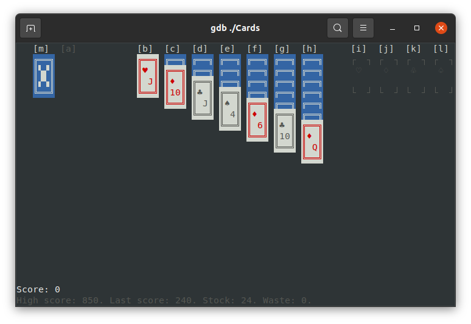
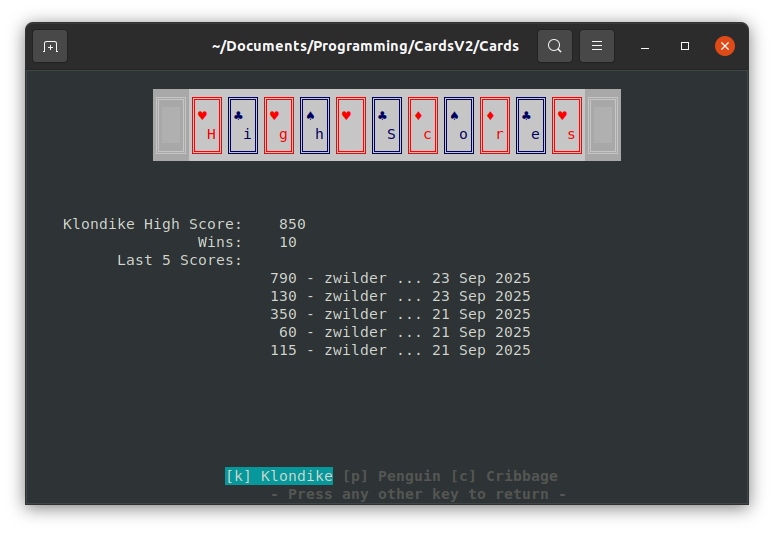

# Cards!

A deck of cards simulator. I designed this with the goal of making the framework
to add any game played with a deck of cards easy to implement. This should run
in most any modern terminal simulator that supports 256 colors (xterm, GNOME
terminal, etc). Nothing but standard C libraries are used (no NCurses
required!), and the program can be built by running `make`. 

The cards are interacted with by pressing a key on the keyboard corresponding to
each card "pile" (tableau, deck, foundation, cell, etc). The first button
pressed selects the card to move, and the second button pressed indicates where
the user would like to move the card. `Esc` "pauses" the game, opening up a menu
where the user can start a new game, return to the main menu, or change card
color settings.

The games included (and mostly completed) so far are:
- Klondike

- Penguin

- Cribbage

The card colors are customizable in a settings screen, where
(using the VI keys, 'hjkl') the user can choose from any of the supported 256
colors.

The games keep track of wins, your last score, and your high score - and you can
see your last five scores on the high scores page!

